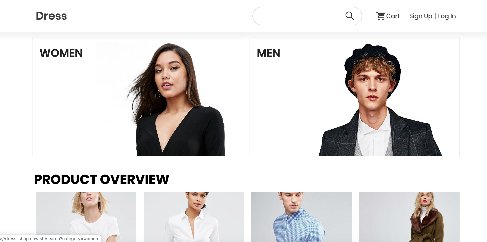
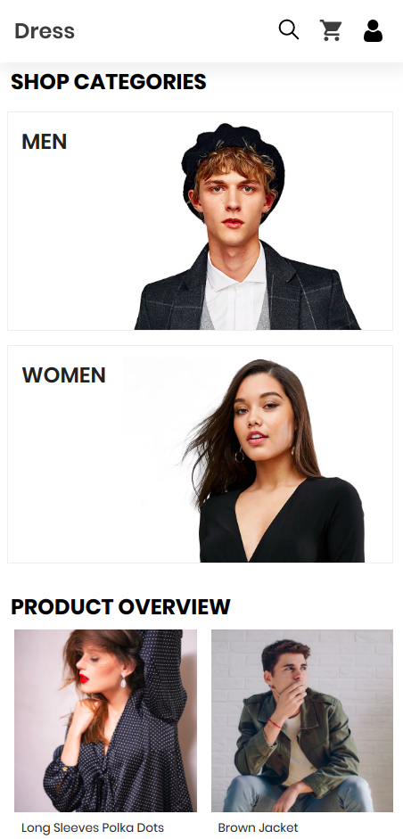

# DRESS SHOP

### A full stack e-commerce website for clothing store.

### [Live demo](https://dress-shop.now.sh)

## Screenshots

### Web View



### Mobile Web View



## Stacks

- Next js
- React js
- Node js
- MongoDB
- Cloudinary (for image hosting)
- Stripe (for payment)
- Now (for deployment)

## Requirements

- Node.js
- Now
- add a .env and .env.build at root folder of project and add the following

```
MONGO_URL="your mongo db uri"
JWT_SECRET="your jwt secret"
STRIPE_KEY= "your stripe key"
CLOUDINARY_URL= "your cloudinary url"
```

## Installation

```
git clone https://github.com/jrussumbrella/dress-shop-web.git
cd dress-shop
npm install or yarn install
now dev
```

## Deployment

```
now --prod
```
