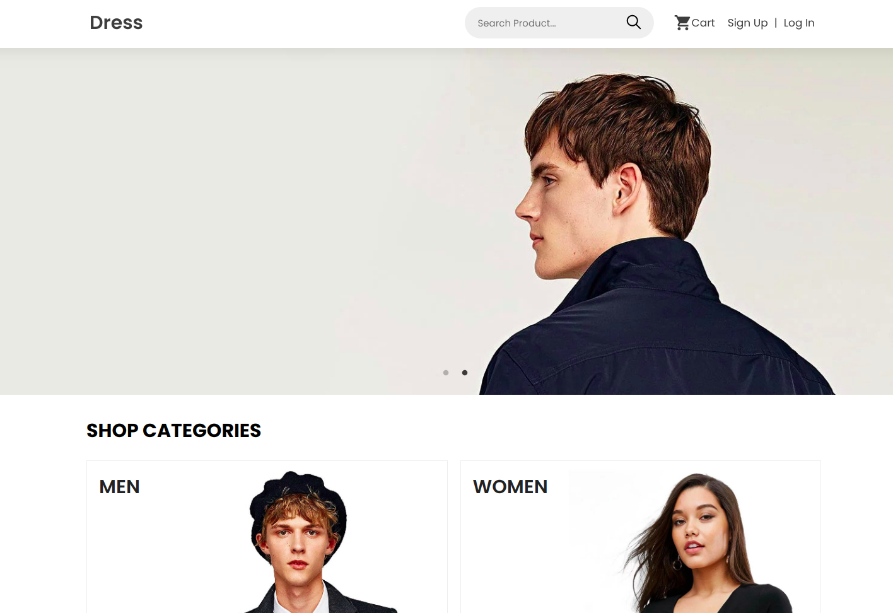

# DRESS SHOP

### A full stack e-commerce website for clothing store.

### [Live demo](https://dress-shop.vercel.app/)

## Screenshots



## Stacks

- TypeScript
- Next js
- Node js
- Express js
- MongoDB
- Cloudinary (for image hosting)
- Stripe and Paypal (for payment)
- Vercel (for deployment)

### Clone Repository

```
git clone https://github.com/jrussumbrella/dress-shop-web.git
```

### Client Installation

```
cd dress-shop
cd client
npm install or yarn install
```

## Server Installation

```
cd server
npm install or yarn install
```

### This will run both client and server

```
npm run dev
```

## Deploy using vercel

### Globally install vercel

```
npm i -g vercel
```

### Client

```
vercel --prod
```

## Server

```
vercel --prod
```
